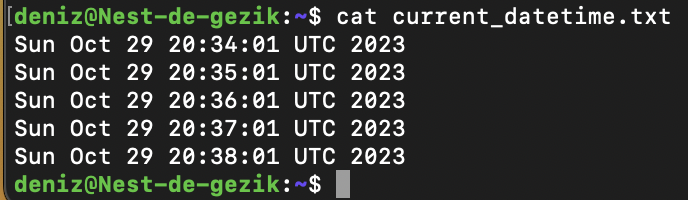

# CRON JOBS

dag 5

Creating a bash script showing the current date and time.
Register in crontab so that it runs every minute
Writing a log file that runs weekly the available disc space
 

## Key-terms
a bash script = is a plain text file which contains a series of commands.
crontab = to automate tasks in Linux
a log file = a useful overview of events. Shows a record of what has happened within a system, which can be used for troubleshooting problems or investigating security incidents.

## Opdracht
### Gebruikte bronnen

- https://operavps.com/docs/log-file-in-linux/

- https://www.geeksforgeeks.org/how-to-get-the-full-path-of-a-file-in-linux/

https://www.digitalocean.com/community/tutorials/how-to-use-cron-to-automate-tasks-ubuntu-1804

 

### Ervaren problemen
- I couldn't get the script running every minute in crontab. Discovered the issue that caused the problem.
- With the final assignment i tried to find a way to get permission to create a log file and save it in /var/log. Once i was able to do this the crontab didn't run the script, unfortunately.  

### Resultaat

task 1)

task2)

task 3)

to get permission:

