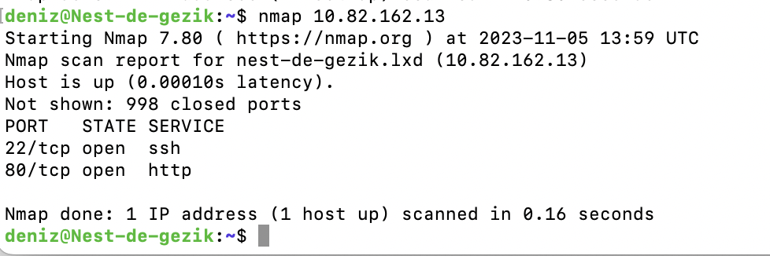

# NETWORK DETECTION

Dag 5/ Week 2

Scanning the network using nmap

## Key-terms
nmap = Network MAPper  
Is een poortscanner.

## Opdracht
### Gebruikte bronnen
- chatgpt:

### Ervaren problemen
I had to figure out what my ip address was within my VM first.

### Resultaat

using nmap:

Wireshark without activity:

Wireshark with activity:

