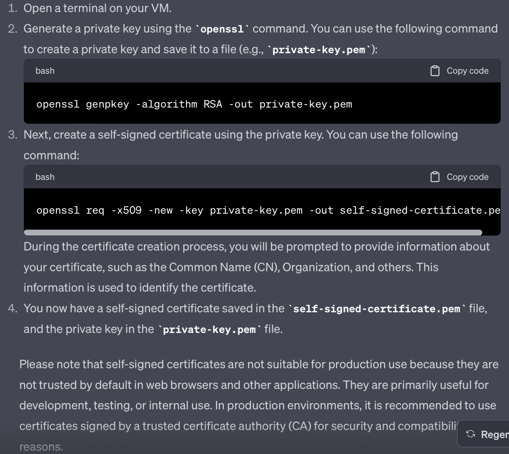

# Public Key Infrastructure

Dag 2/ Week 3

## Key-terms
PKI = is een systeem van processen, technologieën en beleidsregels waarmee u gegevens kunt versleutelen en ondertekenen. U kunt het gebruiken voor het uitgeven van digitale certificaten voor het authenticeren van gebruikers, apparaten en services. Deze certificaten beveiligen de verbinding met zowel openbare webpagina's als privésystemen, zoals uw VPN, intern Wi-Fi-netwerk, wiki-pagina's en andere services die MFA ondersteunen.

## Opdracht

- Create a self-signed certificate on your VM.

### Gebruikte bronnen

- chatgpt

### Ervaren problemen

niet echt.

### Resultaat

