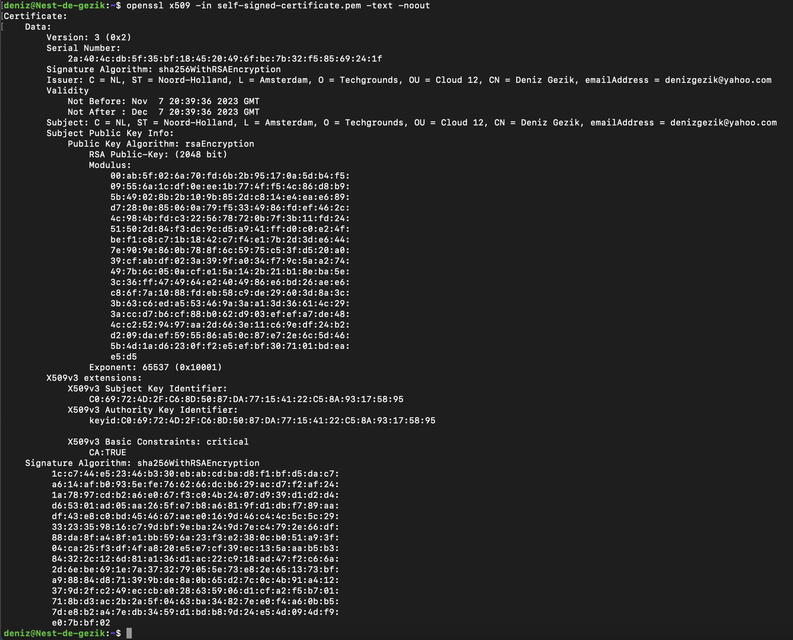

# Public Key Infrastructure

Dag 2/ Week 3

## Key-terms
PKI = is een systeem van processen, technologieën en beleidsregels waarmee u gegevens kunt versleutelen en ondertekenen. U kunt het gebruiken voor het uitgeven van digitale certificaten voor het authenticeren van gebruikers, apparaten en services. Deze certificaten beveiligen de verbinding met zowel openbare webpagina's als privésystemen, zoals uw VPN, intern Wi-Fi-netwerk, wiki-pagina's en andere services die MFA ondersteunen.

X.509 = een standaardformaat dat wordt gebruikt voor het definiëren van digitale certificaten en openbare sleutelinfrastructuur (PKI). Digitale certificaten op basis van de X.509-standaard worden veel gebruikt in beveiligings- en versleutelingstoepassingen, met name in SSL/TLS-communicatie voor het beveiligen van internetverkeer.

## Opdracht

- Create a self-signed certificate on your VM.
- Find the list of trusted certificate roots on your pc/laptop (bonus points if you also find it in your VM).

### Gebruikte bronnen

- chatgpt

- https://linuxize.com/post/creating-a-self-signed-ssl-certificate/

- https://www.digicert.com/nl/what-is-pki

- https://www.kaspersky.nl/resource-center/definitions/what-is-a-ssl-certificate

### Ervaren problemen

niet echt.

### Resultaat

Self-Signed-Certificate:

Find the list of trusted certificate roots on your pc/laptop (bonus points if you also find it in your VM):

