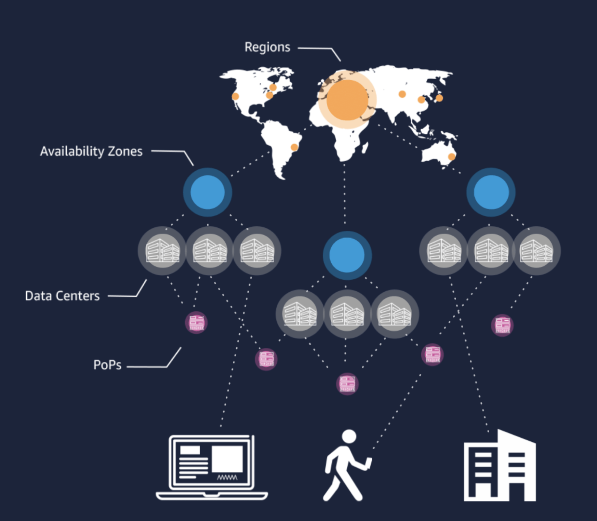

# Global Infrastructure 
AWS verkennen

## Key-terms
S3 = de Simple Storage Service
Lets's you collect, store and analyze data in any amount from anywhere.

PoPs = Points of Presence 

CDN = Content Delivery Network 
 

## Opdracht

<b>Regions</b>

Een regio is een fysieke locatie ergens in de wereld waar ze meerdere Availability Zones aanbieden. Availability Zones bestaan uit één of meer fysieke datacenters.

<b>Availability Zones</b>

In totaal omvat de AWS Cloud 77 Availability Zones en 24 geografische regio’s over de hele wereld.
Availability Zones bestaan uit één of meer fysieke Datacenters. Deze zijn allemaal gebouwd met aparte faciliteiten, redundante stroomtoevoer, netwerkstructuur en verbindingen. Dit allemaal om de betrouwbaarheid en schaalbaarheid van de diensten te vergroten.

<b>Edge Locations</b>

Dat zijn virtuele locaties waar Amazon de mogelijkheid biedt om content via het Content Delivery Network (CDN) Amazon CloudFront te plaatsen zodat deze snel toegankelijk is vanuit elke locatie ter wereld. De netwerkbeheerder heeft zelf de volledige vrijheid voor de toepassing hiervan.

 

### Gebruikte bronnen

- https://www.dataweb.nl/wat-is-amazon-web-services/

 

### Ervaren problemen
Geen.
 

### Resultaat

De keuze voor de ene regio boven de andere in cloud computing, bijvoorbeeld eu-central-1 (Frankfurt) boven us-west-2 (Oregon), hangt af van verschillende factoren. Hier zijn enkele overwegingen:

1) Nabijheid van Gebruikers
2) Compliance en Dataplacement (Dataresidentie)
3) Beschikbaarheid van Diensten
4) Kosten
5) Redundantie en Beschikbaarheid
6) Herstel na Rampen
7) Netwerkconnectiviteit
8) Schaalbaarheid van Resources
9) Ondersteuning en Taalbeschikbaarheid

