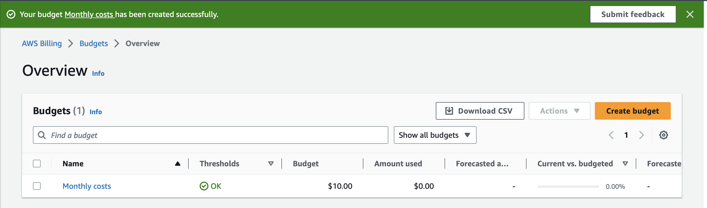

# Pricing

## Key-terms
De Total Cost of Ownership (TCO) wordt gebruikt om te meten hoeveel een infrastructuur zou kosten als deze op de traditionele manier zou worden gehost. Dit gebeurt door het meten van de kapitaaluitgaven (capex). Met het cloudprijsmodel kunt u kapitaalinvesteringen verhandelen voor operationele (variabele) uitgaven (opex). Dit kan de kosten verlagen door geen geld uit te geven aan capaciteit die u niet nodig heeft.

LAMBDA:

In programmeertalen zoals Lisp en JavaScript, wordt het woord <b>"lambda"</b> vaak gebruikt om anonieme functies aan te duiden.

## Opdracht

Het AWS-prijzenmodel biedt verschillende voordelen voor gebruikers, en hier zijn vier belangrijke voordelen:

1. **Pay-as-You-Go-prijzen (Betaling naar Gebruik)** 

2. **Elasticiteit en Schaalbaarheid**

3. **Gereserveerde instanties en Savings Plans (Besparingsplannen)**

4. **Brede Waaier aan Prijzingsmodellen en Diensten**

 
Kapitaaluitgaven (CapEx):

CapEx verwijst naar uitgaven die worden gedaan voor de aanschaf, verbetering of het onderhoud van langetermijnactiva. Deze activa hebben meestal een levensduur van meer dan één jaar en zijn essentieel voor de bedrijfsvoering.
Voorbeelden: Onder CapEx vallen uitgaven voor de aankoop of upgrade van onroerend goed, machines, voertuigen en computersystemen. Kosten voor onderzoek en ontwikkeling die leiden tot langetermijnvoordelen worden ook als kapitaaluitgaven beschouwd.

Operationele Uitgaven (OpEx):

OpEx vertegenwoordigt de dagelijkse, lopende kosten die nodig zijn voor de bedrijfsvoering. Deze kosten worden doorgaans gemaakt in het normale verloop van het bedrijf en worden beschouwd als kortetermijnuitgaven.
Voorbeelden: Gangbare OpEx-items zijn huur, nutsvoorzieningen, salarissen, kantoorbenodigdheden, verzekeringspremies en andere routinematige kosten. Kosten voor reparaties en onderhoud die de levensduur van een activum niet aanzienlijk verlengen, worden ook beschouwd als operationele uitgaven.

### Gebruikte bronnen
- chatgpt
- https://aws.amazon.com/pricing/?aws-products-pricing.sort-by=item.additionalFields.productNameLowercase&aws-products-pricing.sort-order=asc&awsf.Free%20Tier%20Type=*all&awsf.tech-category=*all

- https://www.concurrencylabs.com/blog/choose-your-aws-region-wisely/

- https://docs.aws.amazon.com/AmazonCloudWatch/latest/monitoring/monitor_estimated_charges_with_cloudwatch.html

### Ervaren problemen
[Geef een korte beschrijving van de problemen waar je tegenaan bent gelopen met je gevonden oplossing.]

### Resultaat
Pay less by using more:

Monthly costs:

Monitoring my costs in the cloud:

created a budget:

for monthly costs:
