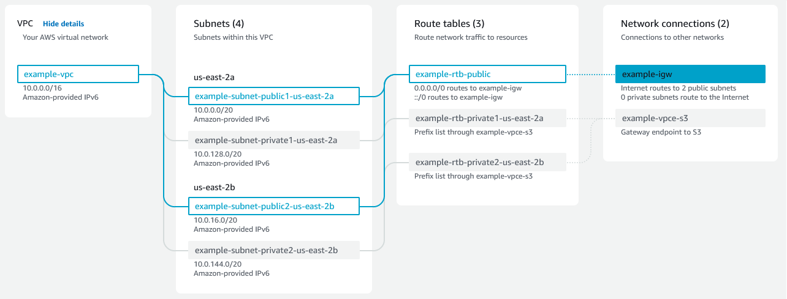

# CORE SERVICES 

Study : 

The AWS Certified Cloud Practitioner (CLF-C01) Exam Guide

## Key-terms

*Amazon EC2* 

staat voor "Elastic Compute Cloud". In het Nederlands wordt Amazon EC2 vaak vertaald als "Elastische Rekenwolk." Het is een cloudcomputingservice waarmee gebruikers virtuele servers (bekend als instances) kunnen huren en configureren voor verschillende doeleinden, zoals het hosten van webapplicaties, het uitvoeren van databases, het verwerken van gegevens en meer. Gebruikers betalen alleen voor de rekenkracht die ze daadwerkelijk gebruiken, waardoor het een kosteneffectieve en flexibele oplossing is voor het hosten van applicaties in de cloud.

*AWS Lambda*

Lambda is een serverloze computingdienst, wat betekent dat gebruikers geen virtuele machines of servers hoeven te beheren. In plaats daarvan kunnen ontwikkelaars code uitvoeren in reactie op specifieke gebeurtenissen, zoals wijzigingen in gegevens, uploads van bestanden of HTTP-verzoeken.

AWS Lambda wordt vaak gebruikt voor taken zoals het verwerken van gegevens, het triggeren van geautomatiseerde taken, het bouwen van back-end services voor webapplicaties en het reageren op gebeurtenissen in andere AWS-services. Het stelt ontwikkelaars in staat om code uit te voeren zonder zich bezig te hoeven houden met de onderliggende infrastructuur, wat de ontwikkeling en implementatie van applicaties vergemakkelijkt.

*AWS Elastic Beanstalk*

is een beheerde dienst van Amazon Web Services (AWS) die het eenvoudig maakt om schaalbare webapplicaties te implementeren en te beheren. Het stelt ontwikkelaars in staat om zich te concentreren op het schrijven van code zonder zich zorgen te maken over de onderliggende infrastructuur. Het is met name geschikt voor projecten waarbij snelheid van implementatie belangrijk is.

*Amazon VPC*

Amazon VPC, wat staat voor Amazon Virtual Private Cloud, is een dienst binnen Amazon Web Services (AWS) waarmee je een privénetwerk in de cloud kunt creëren. Met VPC kun je resources in de AWS-cloud, zoals virtuele machines (Amazon EC2-instances), op een geïsoleerde manier implementeren en beheren.

*Amazon Route 53*

Amazon Route 53 is een domeinnaamregistratiedienst en een cloud-based Domain Name System (DNS)-webdienst aangeboden door AWS.

*Amazon S3*

Amazon S3, oftewel Amazon Simple Storage Service, is een objectopslagdienst. Het is ontworpen om schaalbare en duurzame opslag van objecten, zoals afbeeldingen, video's, documenten en back-ups, mogelijk te maken.

Amazon S3 wordt veel gebruikt voor het opslaan van statische webinhoud, het hosten van back-ups, het implementeren van gegevensarchieven en het ondersteunen van verschillende vormen van gegevensopslag in de cloud. Het is een essentiële dienst binnen het AWS-ecosysteem.

*Amazon S3 Glacier*

Amazon S3 Glacier is een onderdeel van Amazon Simple Storage Service (Amazon S3) en biedt een zeer duurzame, veilige en kosteneffectieve oplossing voor het archiveren van gegevens met een lange bewaartermijn.
Het is ideaal voor het archiveren van gegevens die gedurende lange tijd moeten worden bewaard, maar die niet frequent worden geraadpleegd. Het biedt een kosteneffectieve oplossing voor bedrijven die langdurige opslag van gegevens nodig hebben zonder de noodzaak van snelle toegang.

*Amazon CloudFront*

Amazon CloudFront is een content delivery service (CDN) van AWS waarmee je statische en dynamische webinhoud kunt verspreiden en leveren aan eindgebruikers met een lage latentie en hoge overdrachtssnelheden.

Het wordt vaak gebruikt om de prestaties van webapplicaties te verbeteren door content dichter bij eindgebruikers te plaatsen, waardoor de laadtijden worden verminderd en de gebruikerservaring wordt verbeterd. Het wordt ook ingezet voor het distribueren van media-inhoud, het beveiligen van websites en het optimaliseren van de algehele prestaties van webtoepassingen.

*Amazon RDS*

Amazon RDS, of Amazon Relational Database Service, is een beheerde relationele databaseservice. Het stelt gebruikers in staat om eenvoudig schaalbare, hoogwaardige databases in de cloud in te zetten, te beheren en te schalen zonder dat ze zich zorgen hoeven te maken over het onderliggende hardware- en softwarebeheer of over de operationele complexiteit van traditioneel databasebeheer. Het biedt schaalbaarheid, automatisering en beveiliging voor verschillende soorten applicaties.

*Amazon DynamoDB*

Amazon DynamoDB is een volledig beheerde NoSQL-databaseservice. Het is ontworpen voor het leveren van snelle en schaalbare prestaties voor toepassingen die dynamische, flexibele en zeer schaalbare databases vereisen. 

Het wordt vaak gebruikt voor het bouwen van applicaties met hoge schaalbaarheidsvereisten, zoals webtoepassingen, gaming-toepassingen, mobiele apps en IoT-toepassingen. Het is met name geschikt voor situaties waarin flexibiliteit, snelheid en automatische schaalbaarheid belangrijk zijn.

*Amazon CloudWatch*

Amazon CloudWatch is een monitoring- en beheerservice waarmee je resources en applicaties in de AWS-cloud kunt monitoren en beheren. Het biedt gedetailleerde inzichten in de prestaties, operationele gezondheid en status van je AWS-infrastructuur en applicaties.

Het speelt een cruciale rol bij het beheren en optimaliseren van AWS-omgevingen door real-time monitoring, waarschuwingen en logbeheer te bieden. Het stelt gebruikers in staat om proactief problemen aan te pakken en de prestaties van hun AWS-resources te optimaliseren.

*Amazon CloudFormation*

Amazon CloudFormation is een service waarmee je infrastructuren als code kunt definiëren en implementeren. Het maakt het eenvoudig om AWS-resources te beheren en te implementeren in een geautomatiseerde, herhaalbare en consistente manier. 

Het maakt het proces van het bouwen en bijwerken van AWS-omgevingen efficiënter en minder foutgevoelig. Het is vooral handig in scenario's waarin je complexe architecturen hebt of waar je regelmatig infrastructuur moet implementeren en bijwerken.

*AWS Identity and Access Management*

IAM is een service van Amazon Web Services (AWS) waarmee je veilig toegang kunt beheren tot AWS-services en -bronnen. IAM stelt je in staat om gebruikers, groepen en rollen te maken en te beheren, en om specifieke machtigingen toe te wijzen om toegang tot AWS-resources te regelen.

IAM speelt een cruciale rol in het beveiligen van AWS-resources door het implementeren van het principe van least privilege, waarbij gebruikers en entiteiten alleen de minimale toegangsrechten hebben die nodig zijn om hun taken uit te voeren. Het biedt een centrale controlepunt voor het beheren van toegang en is essentieel voor het handhaven van een veilige AWS-omgeving.

## Opdracht
### Gebruikte bronnen

- https://docs.aws.amazon.com/AWSEC2/latest/UserGuide/concepts.html

- chatgpt

### Ervaren problemen
Ontzettend veel theorie die ik niet kan onthouden, maar wel snap voor het grootste deel..

### Resultaat

Hoe EC2 werkt:

VPC:

