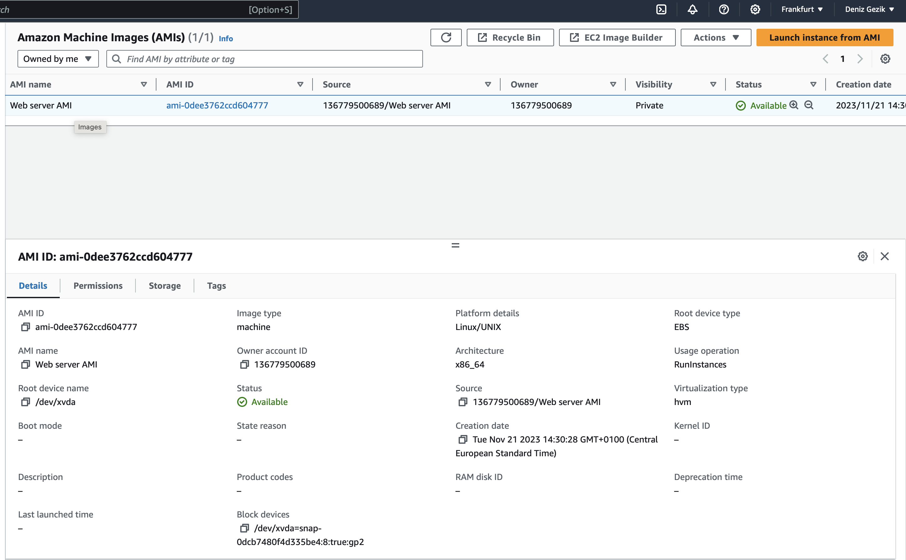
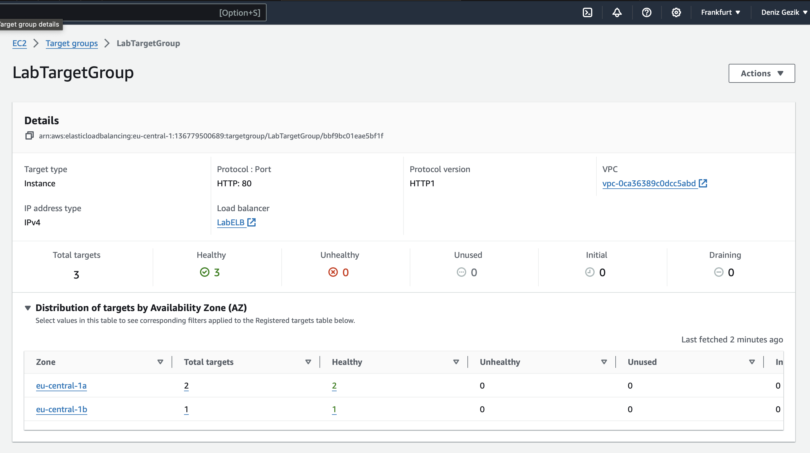
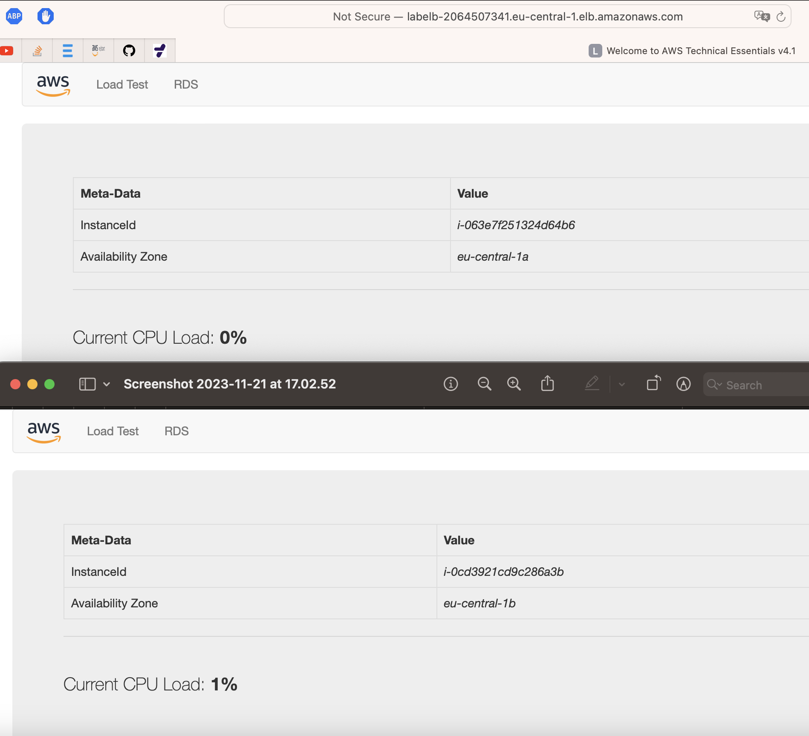

# ELB & AUTO SCASLING

## Key-terms

<b>Elastic Load Balancing (ELB) </b> automatically distributes incoming application traffic across multiple targets and virtual appliances in one or more Availability Zones (AZs).

## Opdracht
### Gebruikte bronnen

- https://docs.aws.amazon.com/AWSEC2/latest/UserGuide/creating-an-ami-ebs.html

- https://docs.aws.amazon.com/elasticloadbalancing/latest/application/create-application-load-balancer.html

- https://medium.com/codex/configuring-and-testing-auto-scaling-in-aws-ec2-60a1434b0eae

- https://docs.aws.amazon.com/elasticloadbalancing/latest/application/create-application-load-balancer.html

- https://docs.aws.amazon.com/autoscaling/ec2/userguide/get-started-with-ec2-auto-scaling.html

### Ervaren problemen

First day i tried the exercises, couldnt finish it. Second day, a second attempt. 

### Resultaat

exercise 1:

Security Group: Allow HTTP.

Wait for the status checks to pass.

Exercise 2:

Create an AMI from your instance with the following requirements:

Image name: Web server AMI

Exercise 3:

Create a launch configuration for the Auto Scaling group. It has to be identical to the server that is currently running. 
Create an auto scaling group with the following requirements:
Name: Lab ASG. 
Launch Configuration: Web server launch configuration  
Subnets: must be in eu-central-1a and eu-central-1b  
Load Balancer: LabELB  
Group metrics collection in CloudWatch must be enabled  
Group Size: v
Desired Capacity: 2  
Minimum Capacity: 2  
Maximum Capacity: 4  
Scaling policy: Target tracking with a target of 60% average CPU utilisation:  

exercise 4:

Verify that the EC2 instances are online and that they are part of the target group for the load balancer.
Access the server via the ELB by using the DNS name of the ELB.
Perform a load test on your server(s) using the website on your server to activate auto scaling. There might be a delay on the creation of new servers in your fleet, depending on the settings on your Auto Scaling Group.

