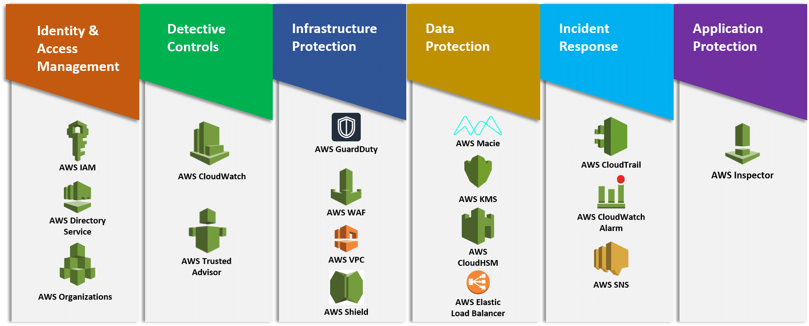

# Well Architected Framework

Understand the six pillars of WAF.

The mnemonic device for the six pillars is CROPSS (the first letter of each pillar). The pillars are:

Cost optimization
Reliability
Operational Excellence
Performance efficiency
Security
Sustainability

## Key-terms
Check "Resultaten"

## Opdracht
### Gebruikte bronnen

- https://www.youtube.com/watch?v=MpDJ6TCWKjk

- https://www.aws.ps/aws-well-architected-framework/

- https://docs.aws.amazon.com/wellarchitected/latest/framework/definitions.html

### Ervaren problemen
none

### Resultaat

<b>Operationele Uitmuntendheid: </b>

Richt zich op operationele aspecten zoals monitoring, incidentrespons en de evolutie van procedures in de loop van de tijd.
Belangrijke overwegingen zijn onder andere het definiëren van organisatorische processen, het monitoren van operationele gezondheid en het continu verbeteren van procedures.

<b>Beveiliging: </b>

Benadrukt het belang van het beschermen van gegevens, systemen en assets.
Belangrijke overwegingen zijn onder andere het implementeren van sterke toegangscontroles, het regelmatig uitvoeren van beveiligingsbeoordelingen en het voldoen aan beveiligingsbest practices.

<b>Betrouwbaarheid:</b>

Richt zich op het waarborgen dat een workload kan herstellen van fouten en aan de eisen van de klant kan voldoen.
Belangrijke overwegingen zijn onder andere het verdelen van workloads over meerdere Beschikbaarheidszones, het automatisch schalen van resources en het ontwerpen voor fouttolerantie.

<b>Prestatie-efficiëntie: </b>

Richt zich op het efficiënt gebruik van resources en het handhaven van prestaties naarmate de vereisten evolueren.
Belangrijke overwegingen zijn onder andere het selecteren van de juiste typen en groottes van resources, het optimaliseren voor prestaties en het gebruik van automatisering om de efficiëntie te verbeteren.

<b>Kostoptimalisatie: </b>

Streeft ernaar onnodige kosten te vermijden en ervoor te zorgen dat resources efficiënt worden gebruikt.
Belangrijke overwegingen zijn onder andere het begrijpen en beheersen van waar geld wordt uitgegeven, het selecteren van de juiste resources voor de workload en het analyseren en optimaliseren in de loop van de tijd.

 

Belangrijke Concepten:

<b>Pijlers en Best Practices: </b>

Het framework biedt gedetailleerde best practices voor elke pijler om architecten te helpen begrijpen en verbeteringen in hun workloads te implementeren.

<b>Review Framework: </b>

Het moedigt regelmatige beoordelingen van workloads tegen deze pijlers aan om gebieden voor verbetering en optimalisatie te identificeren.

<b>Well-Architected Tool: </b>

AWS biedt de Well-Architected Tool, een self-service tool waarmee gebruikers hun workloads tegen het framework kunnen beoordelen en aanbevelingen kunnen ontvangen.

<b>Whitepapers en Documentatie:</b>

AWS biedt whitepapers en documentatie die dieper ingaan op elke pijler en aanvullende begeleiding en voorbeelden bieden.
Door het Well-Architected Framework te volgen, kunnen organisaties ervoor zorgen dat hun AWS-workloads in lijn zijn met best practices, wat leidt tot efficiëntere, veiligere en betrouwbaardere systemen in de cloud.

