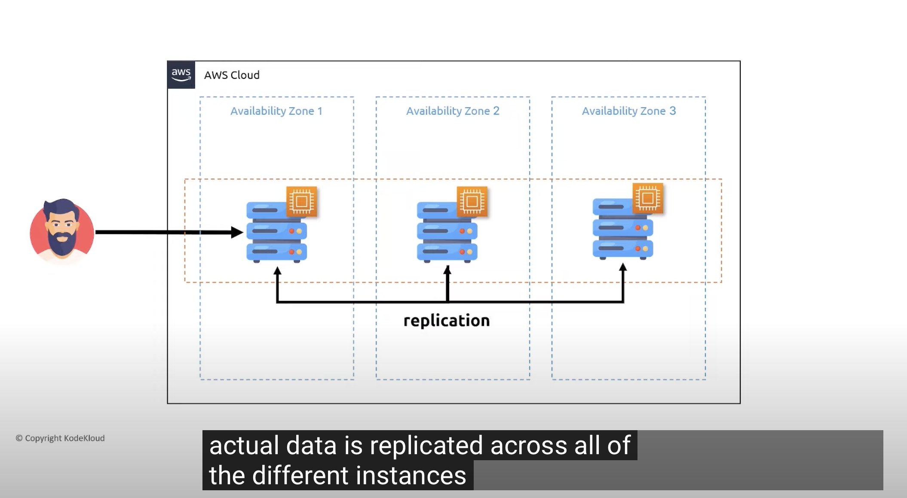

# EFS, EB, CF, R53, RDS

Doe praktische ervaring op met:

- EFS

- RDS/Aurora

- Elastic Beanstalk

Doe theoretische kennis op van:

- CloudFront

- Route53

## Key-terms
- console = controlepaneel
- bursting = temporary peaks in traffic 
- POSIX = Portable Operating System Interface

 

- <b>EFS:</b>  

it's a simple fully managed cloud native file system. EFS provides serverless shared storage so you dont need to provision or manage any infrastructure or capacity. 

 With Amazon EFS, you pay only for the storage used by your file system and there is no minimum fee or setup cost. Amazon EFS offers the following storage class options for different use cases:

<b>Standard storage classes (Recommended) </b> – EFS Standard and EFS Standard–Infrequent Access (Standard–IA), which offer Multi-AZ resilience and the highest levels of durability and availability.

<b>One Zone storage classes </b>– EFS One Zone and EFS One Zone–Infrequent Access (EFS One Zone–IA), which offer you the choice of additional savings by choosing to save your data in a single Availability Zone.

The service is designed to be highly scalable, highly available, and highly durable. Amazon EFS file systems using Standard storage classes store data and metadata across multiple Availability Zones in an AWS Region. EFS file systems can grow to petabyte scale, drive high levels of throughput, and allow massively parallel access from compute instances to your data.

EFS maintains posix files permissions!

 

- <b>RDS/Aurora</b>

RDS = Relational Database Service

A managing database system specifically for SQL bases servers or relational database servers. 
AWS manages/ maintains underlying infrastructure. 
Makes it easy to configure database however you'd like. 
Supports MySQL, PostgreSQL, Oracle, MariaDB, Microsoft SQL server. 
Integrates nicely with other AWS Services.  

Horizontal scaling. 

- <b>Elastic Beanstalk</b>

- <b>CloudFront</b>

Amazon CloudFront is a content delivery network (CDN) operated by Amazon Web Services. The content delivery network was created to provide a globally-distributed network of proxy servers to cache content, such as web videos or other bulky media, more locally to consumers, to improve access speed for downloading the content.

- <b>Route53</b>

is a highly available, scalable Domain Name System (DNS)* service. Released in 2010, its name refers to both the classic highway US Route 66 and the destination for DNS server requests: TCP or UDP port 53. 

It is intended for managing DNS for services and machines deployed on Amazon’s public cloud. The AWS Route 53 DNS service connects user requests to ELB load balancers, Amazon EC2 instances, Amazon S3 buckets, and other infrastructure running on AWS.

*The DNS is basically the phonebook for the internet. It translates human readable names (like www.example.com) to numeric IP adrresses that computer use to talk to each other.

IP addresses on the cloud can change frequently, as services move between data centers and physical machines. This means the translation and communication process is complex.

Organizations that run machines in the cloud using Amazon Web Services (AWS) need an AWS DNS solution—a way to correctly translate user requests into Amazon IP addresses while adapting to cloud changes and quickly propagating them to DNS clients.

## Opdracht
### Gebruikte bronnen

- https://aws.amazon.com/efs/customers/

- https://docs.aws.amazon.com/efs/latest/ug/whatisefs.html

- https://www.youtube.com/watch?v=Aux37Nwe5nc

- https://www.youtube.com/watch?v=0R4s1Al0F1c

https://www.youtube.com/watch?v=qHk-ZFOJa8U

RDS tutorials:

- https://www.youtube.com/watch?v=ylmwaDUMV9c

- https://www.youtube.com/watch?v=Qx1Btn5oroA

Beanstalk aws tutorial:

- https://www.youtube.com/watch?v=2BoVhej0QVI

### Ervaren problemen
none

### Resultaat

<b> “Good intentions never work, you need good mechanisms to make anything happen” — Jeff Bezos. </b>

EFS exercise:

- sudo yum install efs:

- mkdir efs:

RDS exercise:

RDS estimated monthly costs:

Elastic Beanstalk exercise:

