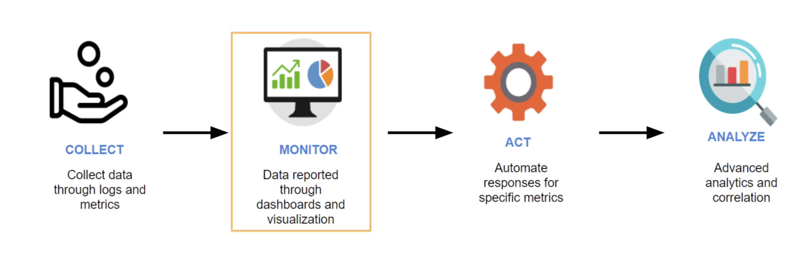

# Cloudwatch

## Key-terms

Cloudwatch is the way to monitor your AWS and is a part of the Operational Excellence in the Well-Architected Framework. 

Benefits:
- Effectively collecting metrics
- Increasing and optimizing operational performance
- Providing insight into correlations
- Integration with other AWS resources

Using AWS resources such as:

- EC2 Instances
- EBS Volumes
- Elastic Load Balancing 
- RDS Instances

Users can access Cloudwatch functions through:
- an Application Programming Interface (API)
- Command Line Tools (CLI)
- AWS SDK / Management Console

## Opdracht
### Gebruikte bronnen

- https://www.youtube.com/watch?v=RQP2q1iXp2g

- https://www.youtube.com/watch?v=lHWrAAzoxJA

### Ervaren problemen
None. Just that with Cloudwatch you are a bit lost what exactly to practice other than setting up an alarm.

### Resultaat

What are the services that can be monitored using Cloudwatch:

Setting up an alarm:

