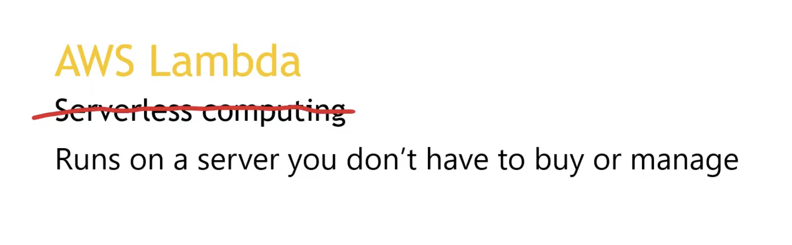

# AWS Lambda 

Welk probleem lost X op?  
Welke key termen horen bij X?  
Hoe past X / vervangt X in een on-premises setting?  
Hoe kan ik X combineren met andere diensten?  
Wat is het verschil tussen X en andere gelijksoortige diensten?  

Een handige lijst van taken die je praktisch moet kunnen:  
Waar kan ik deze dienst vinden in de console?  
Hoe zet ik deze dienst aan?  
Hoe kan ik deze dienst koppelen aan andere resources?  

## Key-terms

With Lambda any event can trigger your function making it easy to build applications that respond quickly to new information.

- The meaning of Serverless:

## Opdracht
### Gebruikte bronnen

- https://www.youtube.com/watch?v=eOBq__h4OJ4

- https://www.youtube.com/watch?v=3Ar1ABlD_Vs

### Ervaren problemen

Lambda function added. Don't know exactly if the blueprint that i have used in my assigment really worked well..

### Resultaat

- Just used this Lambda blueprint as an example for this assignment:

- Updated function:

- Trigger added:

- Monitoring Lambda:

