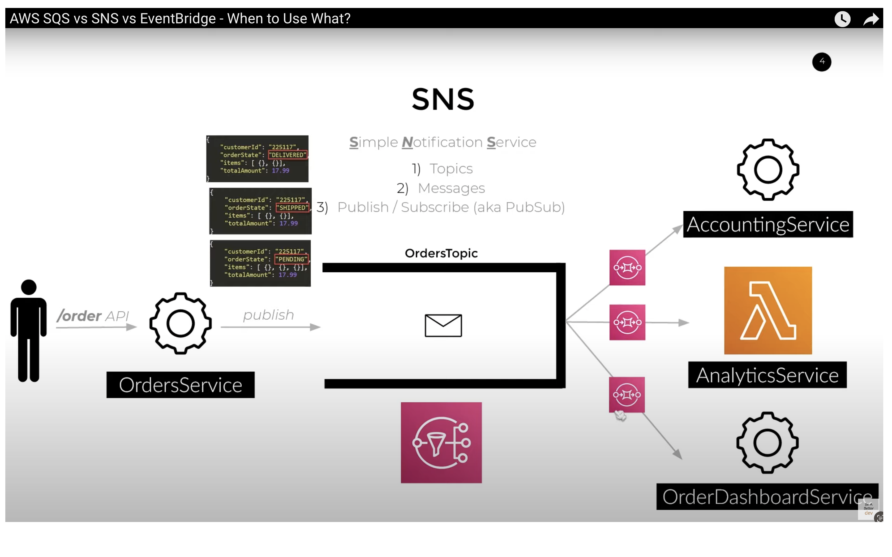

# SNS, SQS, Event Bridge

Welk probleem lost X op?  
Welke key termen horen bij X?  
Hoe past X / vervangt X in een on-premises setting?  
Hoe kan ik X combineren met andere diensten?  
Wat is het verschil tussen X en andere gelijksoortige diensten?  

Een handige lijst van taken die je praktisch moet kunnen:  
Waar kan ik deze dienst vinden in de console?  
Hoe zet ik deze dienst aan?  
Hoe kan ik deze dienst koppelen aan andere resources?  

## Key-terms

QUEUE:

Een <b>QUEUE</b> (Engels voor wachtrij) is in de informatica een datastructuur voor de opslag van een wisselend aantal elementen waarbij geldt dat het element dat het eerst werd toegevoegd het eerst wordt verwijderd (FIFO).

De operaties op een queue zijn:

enqueue (of put): een element wordt in de queue geplaatst
dequeue (of get): een element wordt uit de queue gehaald
empty: test of de queue leeg is
Soms wordt ook wel ondersteund:

size: retourneert het aantal elementen in de queue
Daarbij kunnen de volgende fouten optreden:

underflow: een poging om een element uit een lege queue te halen.
overflow: een poging om een element aan een volle queue toe te voegen. Dit kan alleen als de queue een begrensde grootte heeft.

API:

Een <b>API</b>, of een Application Programming Interface, wordt gebruikt om op een geformaliseerde manier gegevens uit te wisselen tussen apps. Veel voorzieningen bieden openbare API's waarmee iedereen inhoud naar de voorziening kan sturen en van de voorziening kan ontvangen.

<b>SQS = Simple Queue Service.</b>

This service works one to one. 

It is used for <b>One to One</b> reliable asynchronous service and basically allow search to DECOUPLE our business application stuff. 

Has 3 parameters:

- Message  
- Queue  
- Polling  

<b>SNS = Simple Notification Service </b>

It allows one to many (this is the major difference with SQS). 
Provides us an High Throughput & allows to have Many Subscribers.

Ideal for building scalable enterprise applications.

Has 4 parameters:
- Publish  
- Message  
- Topics  
- Subscribe  
 

<b>EVENT BRIDGE</b>

It allows to have <b>One to Many</b> kind of communication. 
But the Many here is restricted to 5!

It also allows to filter messages, defined rules so that we can based on the parameters or the conditions, within the incoming message, we can decide what should be the destination target for that message
(makes it very suitable for SaaS, Application Integrations e.g. MongoDB Atlas).

It has 4 parameters:
- Message Bus  
- Events  
- Rules  
- Targets  

IN GENERAL:

Why does it have to Decouple applications?

- Loose Coupling:

Decoupling through SQS promotes loose coupling between components. Each component only needs to understand the message format and the queue structure, not the internal implementation details of other components. This makes it easier to evolve and update components without affecting the entire system.

- Decoupled Release Cycles:  

When components are decoupled, they can have independent release cycles. Teams can update or release new versions of components without affecting the entire system, provided they maintain compatibility with the messages exchanged via SQS.

- Interoperability:  

Decoupling allows for better interoperability between different services or systems. As long as components adhere to the agreed-upon message format, they can be implemented in different languages or technologies.

 

SNS, SQS, Event Bridge: 

BASICALLY THESE ARE THE THREE SERVICES THAT ARE AVAILABLE AWS WHICH ONE WOULD USE FOR <b> DECOUPLING OF APPLICATIONS </b> AND <b>TO BUILT AN ENTERPRISE READY SCALABLE ECOSYSTEM</b>. 

## Opdracht
### Gebruikte bronnen

- https://www.youtube.com/watch?v=4Nr29Kz8N6c

- https://www.youtube.com/watch?v=RoKAEzdcr7k

### Ervaren problemen

### Resultaat

Chatgpt:

<b>"Fan-out"</b> is a term commonly used in distributed systems and messaging architectures to describe the process of broadcasting a message to multiple consumers or downstream components. It's the opposite of "fan-in," where multiple sources send messages to a single destination.

In the context of messaging systems like Amazon Simple Queue Service (SQS) or publish-subscribe patterns, fan-out typically refers to the ability to send a message from one producer to multiple consumers or subscribers.

SNS :

