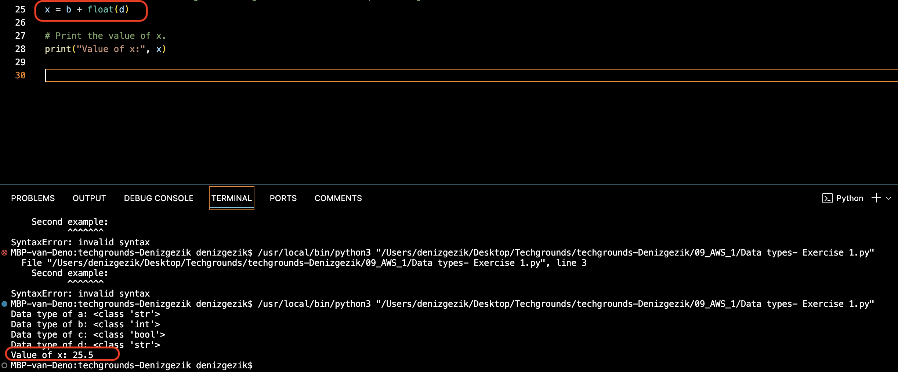
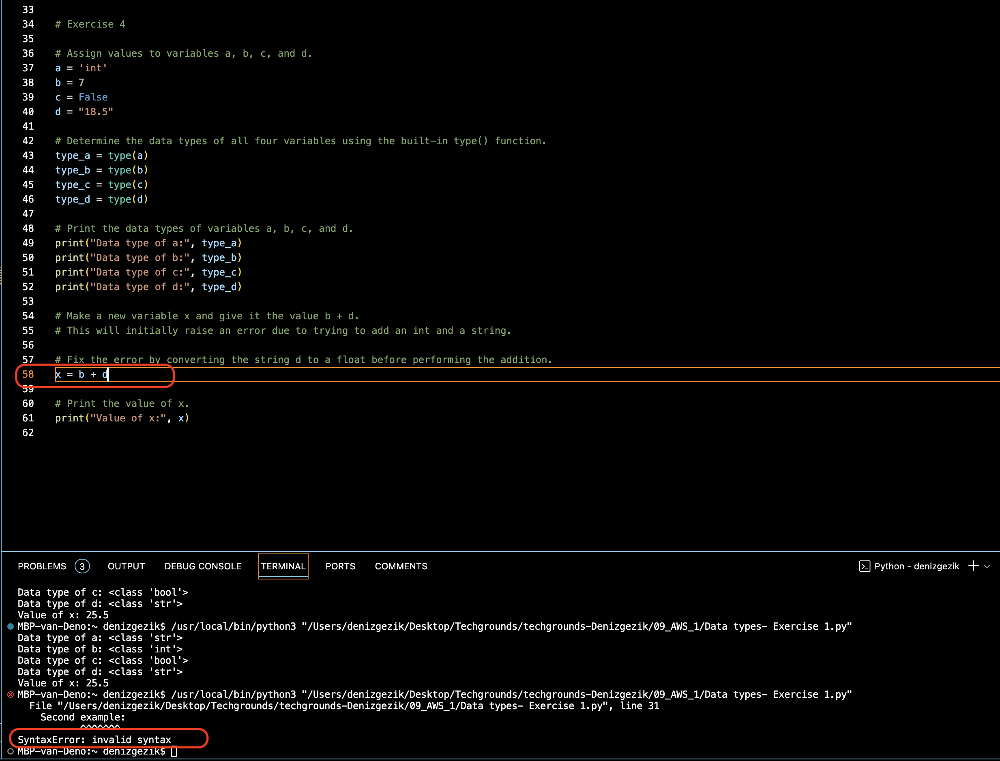

# Data types and comments

Exercise 1:

- Create a new script.  

- Copy the code below into your script. 
a = 'int' 
b = 7 
c = False 
d = "18.5" 
- Determine the data types of all four variables ( a, b, c, d) using a built-in function. 
- Make a new variable x and give it the value b + d. Print the value of x. This will raise an error. Fix it so that print(x) prints a float. 
- Write a comment above every line of code that tells the reader what is going on in your script. 

Exercise 2:

- Create a new script. 
- Use the input() function to get input from the user. Store that input in a variable. 
- Find out what data type the output of input() is. See if it is different for different kinds of input (numbers, words, etc.). 

## Key-terms

<b>boolean</b>  
A binary state that is either True or False. 
boolean = True 

<b>String</b>  
Technically an array of characters. Strings are denoted using “ ” double quotes or ‘ ’ single quotes.  
string = "This is a string"  

<b>Int</b>  
An integer is a whole number. Ints can be both positive and negative.  
integer = 6  

<b>Float</b>  
A floating-point number is a decimal number.  
floating_point = 18.5  

<b>Comments</b> are lines that do not get processed as code. This can be used for multiple purposes. For example, you can write a short description of what a block of code does. You can also ‘comment out’ some code, so that it is temporarily removed. This can be useful for testing and debugging.

## Opdracht
### Gebruikte bronnen

- ChatGPT & Bard (Google)

### Ervaren problemen
none

### Resultaat

- Exercise 1:

error version:

fixed (including float) version:

- Exercise 2:

