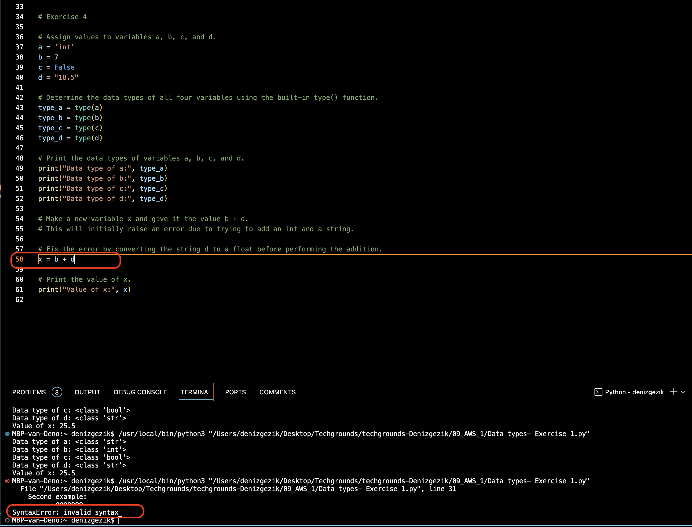
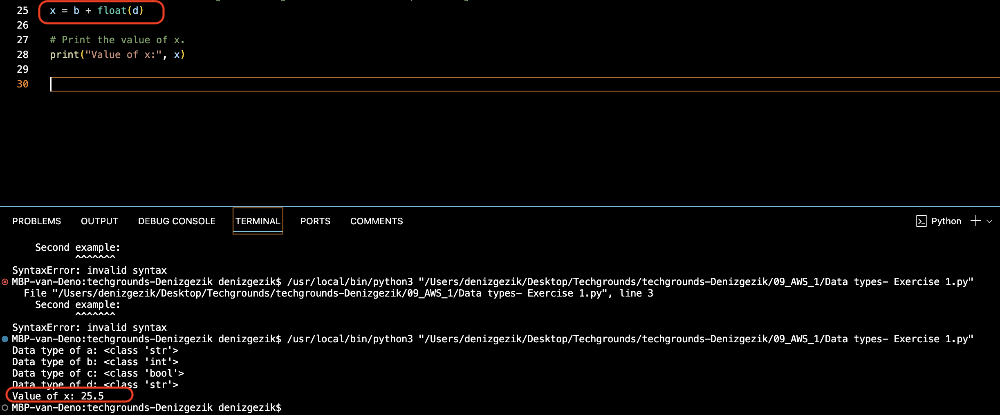

# [Onderwerp]
[Geef een korte beschrijving van het onderwerp]

## Key-terms

<b>boolean</b>  
A binary state that is either True or False. 
boolean = True 

<b>String</b>  
Technically an array of characters. Strings are denoted using “ ” double quotes or ‘ ’ single quotes.  
string = "This is a string"  

<b>Int</b>  
An integer is a whole number. Ints can be both positive and negative.  
integer = 6  

<b>Float</b>  
A floating-point number is a decimal number.  
floating_point = 18.5  

<b>Comments</b> are lines that do not get processed as code. This can be used for multiple purposes. For example, you can write a short description of what a block of code does. You can also ‘comment out’ some code, so that it is temporarily removed. This can be useful for testing and debugging.

## Opdracht
### Gebruikte bronnen
[Plaats hier de bronnen die je hebt gebruikt.]

### Ervaren problemen
[Geef een korte beschrijving van de problemen waar je tegenaan bent gelopen met je gevonden oplossing.]

### Resultaat

error version:

fixed (including float) version:

Exercise 2:

