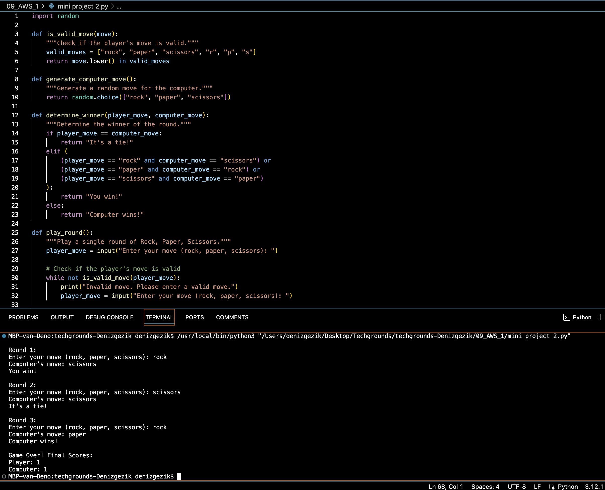

# Mini Project 2

Rock Paper Scissors:

The player plays against a computer opponent typing either a letter (rps) or an entire word (rock paper scissors) to play their move.  
Create a function that checks whether the move is valid or not.  
Create another function to create a computer move. 
Create another function to check who wins the round.  
Finally, create a function that keeps track of the score. 
The game should be played in a predetermined number of rounds. 

## Key-terms

## Opdracht
### Gebruikte bronnen
ChatGPT & Bard (Google)

### Ervaren problemen
[Geef een korte beschrijving van de problemen waar je tegenaan bent gelopen met je gevonden oplossing.]

### Resultaat

- Rock Paper Scissors:

