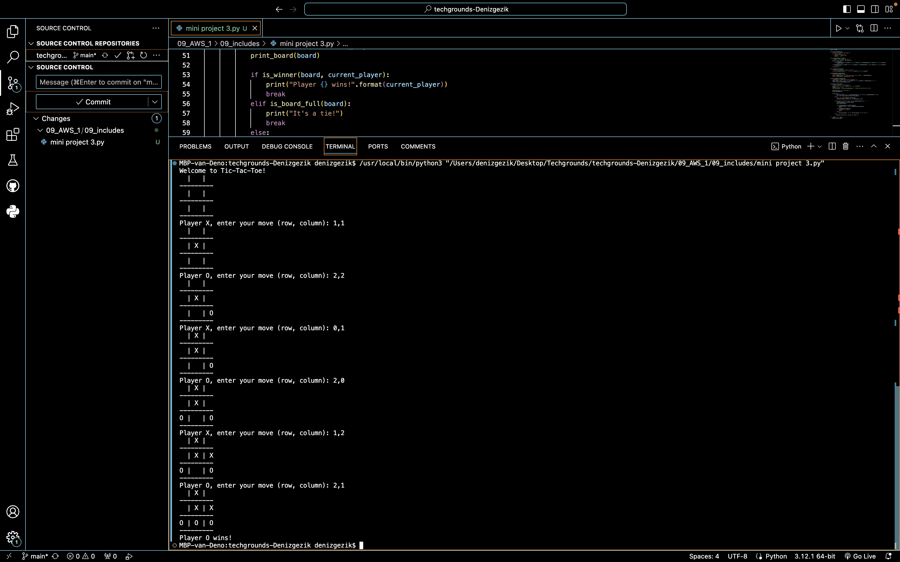

# Mini project 3

Tic-Tac-Toe:

- Generate a 3x3 board on the command line.  
- This is a 2-player game, where one player inputs “X” and the other player inputs “O”.  
- Bonus: create a single-player version that you can play against the computer. 

## Key-terms

## Opdracht
### Gebruikte bronnen
ChatGPT & Bard (Google)

### Ervaren problemen
Volledig met de hulp van ChatGPT en Google Bard!
Te moeilijk anders.

### Resultaat

- Tic Tac Toe:

Extra extra, read all about it! :

